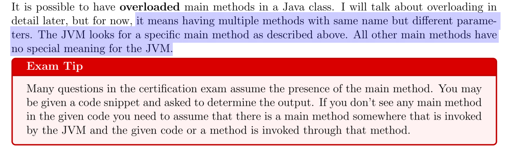

# java-practice
# Ejemplos construidos desde libro OCA Oracle certified Associate Java SE 8 IZO-808

# Java basic
JDK cuenta  con una JRE.
Virtual Machine EL intreprete que toma el codigo .class y lo traduce al lenguaje de la maquina.
JRE Enviroment ? Maquina virtual mas clases precompiladas. Se puede descargar para que cada sistema opertivo ejecute aplicaciones. 

# Se corre una clase java, no se ejecuta. 
Se invoca a la JVM se pasa como argumento el nombre de la clase mas un argumento "java".
ej: c:> java nombreClase

# main permitidos
public static void main(String[]args){}

public static void main(String ... args){}

public static void main(String[]args)throws Exception{
    //puede lanzar cualquier exception.
    throw new Exception();
}

# sobrecarga
@overloading - metodo dentro de un contexto de clase, don mismo nombre y distintos parametros.
@override    - se da en un contexto de herencia. Se sobreescribe el metodo de la clase padre. 

